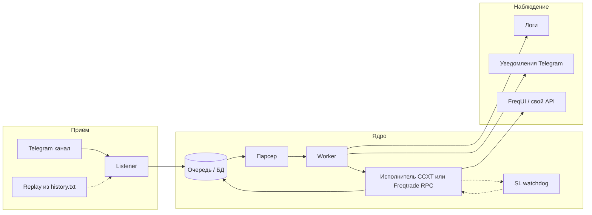

# Фаза C: сигнальный канал → исполнение (архитектура форка)

Документ для форка `aabudeev/freqtrade`. Пошаговый чеклист с коммитами — в **`IMPLEMENTATION_PLAN.md`** (локально, в `.gitignore`).

## Исходные данные

- Экспорт истории канала (локально): `history_01_01_2025-18_04_2026.txt` (формат строк: дата, префикс канала, тело сигнала).
- Числовой **ID канала** из настроек/экспортёра: **`1566432615`**. В **Telethon / MTProto** у супергрупп/каналов peer часто задаётся как **`-100<id>`** (например `-1001566432615`). Точное значение проверить при первом подключении через `get_dialogs()` или документацию клиента; в конфиг выносить **готовый int peer**, как сработало в рабочем приложении.

## Почему сначала авторизация (QR), а не парсер

- Вход по **SMS** для новых сессий часто недоступен или неудобен.
- Уже используется сценарий **QR**: десктоп/CLI показывает QR, **официальное приложение Telegram** сканирует и подтверждает вход — тот же поток нужно повторить в **Telethon** (или Pyrogram, если там есть аналог QR login).
- После первого логина сохраняется **файл сессии** (`*.session` + при Telethon часто `*.session-journal`): дальнейший **listener** работает без QR, пока сессия валидна.

**Секреты:** `api_id`, `api_hash` с https://my.telegram.org ; путь к сессии — только env / volume, в Git не коммитить.

### Сессия Telegram: обновление и сбой

- Первичный вход: скрипт **`scripts/signals/telegram_qr_login.py`** (зависимости: **`requirements-signals.txt`**).
- Если сессия протухла или устройство отвязано — снова запустить скрипт (QR). Файлы **`*.session`** не бэкапить в открытый Git.
- При **2FA** на аккаунте: переменная окружения **`TELEGRAM_2FA_PASSWORD`** (осторожно) или интерактивный ввод в скрипте.

## Целевой поток (что происходит с сообщением)

1. **Listener** (или **replay-драйвер**) кладёт сырое событие в **очередь** с идемпотентным ключом (например `channel_id + message_id` или хеш текста + время для replay).
2. **Worker** забирает задачу, вызывает **парсер** → структура `SignalEvent` (вход / выход / шум).
3. Для **входа**: в тексте сигнала явно заданы **диапазон/точка входа**, **take-profit**, **stop-loss**. Исполнитель передаёт эти уровни в **ордера биржи** (entry + защитные/триггерные заявки там, где BingX USDT-M swap и CCXT это позволяют). **Не полагаться** на постоянный опрос цены «дошла ли до TP/SL» как основной механизм — основная логика срабатывания на стороне биржи.
4. **Take-profit:** по умолчанию фиксированный уровень из сигнала на бирже; **трейлинг take-profit** — опциональное улучшение (если API/типы ордеров BingX и обвязка позволяют), отдельно описать в конфиге и в `docs/signals-format.md`.
5. **Stop-loss — обязательная подстраховка:** даже при выставленном на бирже SL исполнитель ведёт **watchdog** (фоновый цикл с настраиваемым интервалом): сверка открытой позиции, рыночной цены и защитных ордеров. Если **цена прошла уровень SL**, а позиция **всё ещё открыта** (биржа не исполнила, задержка, сбой, и т.д.) — **принудительное закрытие** рыночным reduce-only (или эквивалент) и **алерт**. Это не заменяет биржевой SL, а страхует от «дыры».
6. Для **выхода** по тексту канала («тейк ✅», «стоп»): как **дополнительный** сигнал к уже открытой сделке — сверка с позицией, при необходимости догоняющее закрытие или корректировка; если позиция уже закрыта биржей по TP/SL — только уведомление/запись в БД.
7. **Уведомления**: отдельный **Bot API**-бот (только исходящие сообщения админу) или тот же пользовательский аккаунт — политика позже; минимум — один канал «отбивок».
8. **Веб**: графики и сделки из **FreqUI**, если исполнение идёт через **Freqtrade** и сделки попадают в `tradesv3.sqlite`. Если исполнитель только **CCXT**, без Freqtrade — нужен маленький **status API** + простая страница или доработка позже.

## Listener / парсер — отдельный демон?

**Рекомендация для MVP:**

- **Один процесс** (async): цикл Telethon `events.NewMessage` + запись в **SQLite/Redis** + лёгкий worker в том же процессе — проще деплой и отладка.
- **Два сервиса** в Docker (listener + worker) — когда появятся ретраи, нагрузка и отдельное масштабирование.

И то и другое — «демон» в смысле **долгоживущий процесс**, не cron.

## Тестирование без ожидания сигналов в канале

- **Replay:** модуль читает строки из `history_01_01_2025-18_04_2026.txt` (или укороченной копии в `tests/fixtures/`) и публикует их **в ту же внутреннюю очередь**, что и live listener (тот же формат внутреннего события).
- **Юнит-тесты парсера** на вырезках строк (LONG/SHORT, тейк, стоп).
- **Интеграционный тест** «replay → parse → mock executor» без сети биржи.

Полный файл истории **не обязательно** коммитить (объём); в репозитории — **короткая анонимизированная выборка** для CI.

## «Игровой» баланс ~200k и FreqUI

| Подход | Что видит FreqUI |
|--------|-------------------|
| **Реальные ключи BingX (prod)** | Реальный баланс USDT (как сейчас). |
| **`dry_run: true` в Freqtrade** | Симулированный кошелёк **внутри Freqtrade**, **не** связан с виртуальными 200k на BingX. |
| **Ключи + VST / sandbox BingX** (`open-api-vst`, как в `bingx_swap_smoke_trade.py --demo`) | Баланс и PnL **с демо-счёта биржи** — ближе всего к «игровым» 200k. |

Для этапа проверки **до реальных USDT** логично поднять **отдельный профиль** Docker / `user_data`: те же пары, но **API к VST** и при необходимости отдельная БД Freqtrade, чтобы не смешивать с прод-историей.

## Уведомления: вход, работа, закрытие, PnL

- Минимальный контракт события для нотификатора: `signal_id`, `symbol`, `side`, `event` (`parsed` / `order_submitted` / `filled` / `closed_tp` / `closed_sl` / `error`), `pnl` (если есть), `link` в FreqUI (опционально).
- Источник PnL: ответ биржи при закрытии или расчёт из цены входа/выхода — зафиксировать в **C.0**.

## Связанные файлы

- План: **`IMPLEMENTATION_PLAN.md`** — фаза **C** (порядок: **C.auth → C.replay → C.0 …**).
- Дорожная карта: **`PROJECT_SESSION_AND_ROADMAP.md`**.
