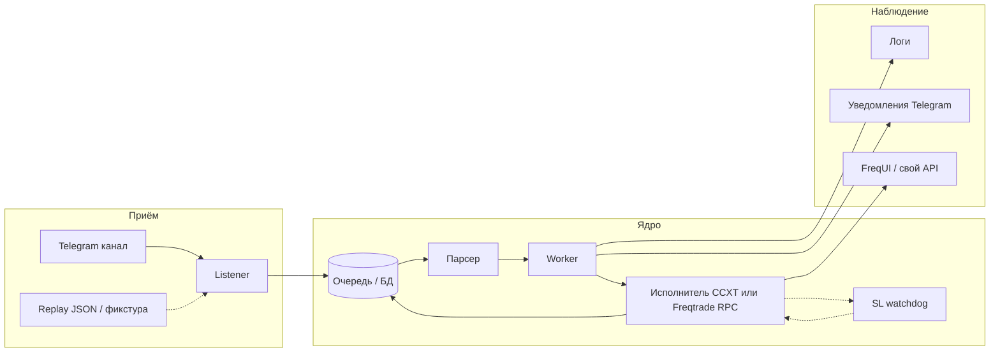

# Фаза C: сигнальный канал → исполнение (архитектура форка)

Документ для форка `aabudeev/freqtrade`. Пошаговый чеклист с коммитами — в **`IMPLEMENTATION_PLAN.md`** (локально, в `.gitignore`).

## Исходные данные

- **Канал:** **`TELEGRAM_SIGNALS_CHANNEL_ID`** в `.env` / compose (числовой id без `-100`; в коде peer: **`-100<id>`**). Для снятия сырых сообщений — **`dump_channel_messages_json.py`** (см. раздел про replay ниже).
- Старый построчный экспорт из клиента (`history_*.txt`) — только для ознакомления / legacy-парсера **`history_export`**, в Git не тащить.

## Почему сначала авторизация (QR), а не парсер

- Вход по **SMS** для новых сессий часто недоступен или неудобен.
- Уже используется сценарий **QR**: десктоп/CLI показывает QR, **официальное приложение Telegram** сканирует и подтверждает вход — тот же поток нужно повторить в **Telethon** (или Pyrogram, если там есть аналог QR login).
- После первого логина сохраняется **файл сессии** (`*.session` + при Telethon часто `*.session-journal`): дальнейший **listener** работает без QR, пока сессия валидна.

**Секреты:** `api_id`, `api_hash` с https://my.telegram.org ; путь к сессии — только env / volume, в Git не коммитить.

### Сессия Telegram: обновление и сбой

- **Автовход при старте бота (рекомендуется на сервере):** в `.env` задать **`ENABLE_TELEGRAM_SIGNAL_AUTH=1`**, **`TELEGRAM_TOKEN`** / **`TELEGRAM_CHAT_ID`** (тот же бот, что у Freqtrade), **`TELEGRAM_API_ID`** / **`TELEGRAM_API_HASH`**, при приёме сигналов — **`TELEGRAM_SIGNALS_CHANNEL_ID`**. Контейнер перед `freqtrade trade` в **`run_freqtrade_with_auth.sh`** последовательно запускает: **`preflight_telegram_auth.py`** (если сессии нет — QR в бот), затем **`preflight_channel_smoke.py`**: подключение MTProto, чтение до **`TELEGRAM_CHANNEL_SMOKE_LIMIT`** (по умолчанию 20) последних сообщений канала, проверка что хотя бы часть маппится в **`SignalIngestEvent`** (текст + `PeerChannel`). При ошибке контейнер **не** стартует `freqtrade trade`. Отключить проверку: **`SKIP_TELEGRAM_CHANNEL_SMOKE=1`**. Файл сессии в `user_data/.secrets/` на томе.
- **MTProto и прокси:** Telethon **не** использует `HTTP_PROXY` сам по себе. В образе прокси задаётся тем же **`TG_PROXY`** (или **`TELEGRAM_MTPROXY`**, `HTTP_PROXY`): модуль **`freqtrade.signals.telethon_proxy`** собирает tuple для `TelegramClient(..., proxy=...)`. Без прокси при блокировке DC будет таймаут к `149.154.x.x`. Для применения `proxy=` Telethon требует пакет **`python-socks`** (см. **`requirements-signals.txt`**); только **`PySocks`** в Dockerfile недостаточно — иначе в логах предупреждение *proxy argument will be ignored*.
- Ручной вход (отладка): **`scripts/signals/telegram_qr_login.py`**. Зависимости **`requirements-signals.txt`** ставятся **при сборке** образа (`Dockerfile.socks`).
- Если сессия протухла или устройство отвязано — снова запустить скрипт (QR). Файлы **`*.session`** не бэкапить в открытый Git.
- При **2FA** на аккаунте: переменная окружения **`TELEGRAM_2FA_PASSWORD`** (осторожно) или интерактивный ввод в скрипте.

## Целевой поток (что происходит с сообщением)

1. **Listener** (или **replay-драйвер**) кладёт сырое событие в **очередь** с идемпотентным ключом (например `channel_id + message_id` или хеш текста + время для replay).
2. **Worker** забирает задачу, вызывает **парсер** → структура `SignalEvent` (вход / выход / шум).
3. Для **входа**: в тексте сигнала явно заданы **диапазон/точка входа**, **take-profit**, **stop-loss**. Исполнитель передаёт эти уровни в **ордера биржи** (entry + защитные/триггерные заявки там, где BingX USDT-M swap и CCXT это позволяют). **Не полагаться** на постоянный опрос цены «дошла ли до TP/SL» как основной механизм — основная логика срабатывания на стороне биржи.
4. **Take-profit:** по умолчанию фиксированный уровень из сигнала на бирже; **трейлинг take-profit** — опциональное улучшение (если API/типы ордеров BingX и обвязка позволяют), отдельно описать в конфиге и в `docs/signals-format.md`.
5. **Stop-loss — обязательная подстраховка:** даже при выставленном на бирже SL исполнитель ведёт **watchdog** (фоновый цикл с настраиваемым интервалом): сверка открытой позиции, рыночной цены и защитных ордеров. Если **цена прошла уровень SL**, а позиция **всё ещё открыта** (биржа не исполнила, задержка, сбой, и т.д.) — **принудительное закрытие** рыночным reduce-only (или эквивалент) и **алерт**. Это не заменяет биржевой SL, а страхует от «дыры».
6. Для **выхода** по тексту канала («тейк ✅», «стоп»): как **дополнительный** сигнал к уже открытой сделке — сверка с позицией, при необходимости догоняющее закрытие или корректировка; если позиция уже закрыта биржей по TP/SL — только уведомление/запись в БД.
7. **Уведомления**: отдельный **Bot API**-бот (только исходящие сообщения админу) или тот же пользовательский аккаунт — политика позже; минимум — один канал «отбивок».
8. **Веб — единая картина по стратегии «следовать сигналам» (требование):** в интерфейсе должны быть видны **все** сущности пайплайна: **ещё не исполненные** (в очереди / распарсено / ошибка парсинга), **открытые** (позиция на бирже), **закрытые** (PnL, причина закрытия). Стандартный **FreqUI** опирается на **`tradesv3.sqlite`** и показывает в основном то, что оформил **сам бот**; сообщения канала и «ожидание входа» туда **не попадают**. Поэтому целевой дизайн форка:
   - **Единый журнал сделок по сигналам** (отдельная SQLite или таблицы рядом с очередью), куда пишут listener / worker / исполнитель: статусы `pending` → `parsed` → `submitted` → `open` → `closed` (+ поля entry/TP/SL, ids ордеров, PnL).
   - **HTTP API** в том же процессе, что и **Freqtrade API server** (FastAPI в `freqtrade/rpc/api_server/`): например префикс **`/api/v1/signals/...`** (список, деталь, фильтр по статусу) с той же аутентификацией, что у остального API.
   - **Страница в браузере:** либо **отдельная статическая/лёгкая страница** (например маршрут до SPA catch-all в `web_ui.py`), либо позже **вкладка во FreqUI** (отдельный репозиторий `frequi`, больше работы). Для MVP достаточно одной страницы «Сигналы», которая ходит в `/api/v1/signals/*` и показывает таблицу + базовый график (pair + отметки входа/TP/SL при желании через существующие эндпоинты свечей).
   - Если исполнение **только CCXT** без записи в Freqtrade — **всё равно** тот же журнал + API + страница; FreqUI тогда дополнительный, а не единственный источник правды по сигналам.

## Git, push и «почему не вижу файлов в коммите»

- Файлы **`docs/private/...`**, **`scripts/signals/...`**, **`requirements-signals.txt`**, правки **`.gitignore`** уже лежат в **git** внутри каталога **`freqtrade/`** (коммит в форке). Если в Cursor открыт **родительский** репозиторий `copyCryptoTradeBot`, панель Git может показывать только корень — открой **папку `freqtrade` как workspace** или коммить из терминала: `cd .../freqtrade && git status`.
- Чтобы на **сервере** появилось после `git pull`: нужен **`git push`** с машины, где сделан коммит (`origin/main` не устарел). Ручное копирование не требуется, если pull/push настроены.
- Секретов в этих файлах нет; в Git по-прежнему **не** коммитить **`*.session`**, **`.env`**, ключи биржи.

## Где делать QR-логин Telegram (не обязательно «на хосте разработки»)

Скрипт нужен **один раз** (или при сбросе сессии), чтобы получить файл **`*.session`**. Варианты:
1. **Локально** (ноутбук): запустить `telegram_qr_login.py`, отсканировать QR, затем **скопировать** `user_data/.secrets/telegram_signals.session` на сервер (scp/rsync/Docker volume) — listener на сервере использует тот же файл.
2. **На сервере**: `ssh -t user@host 'cd /path/to/freqtrade && docker compose run --rm -it freqtrade ...'` (или venv), если терминал нормально рисует ASCII-QR; иначе неудобно.
3. **В контейнере** с примонтированным каталогом `user_data`: после появления `.session` на хосте контейнер подхватывает без пересборки.

Переменные **`TELEGRAM_API_ID` / `TELEGRAM_API_HASH`** (и при необходимости путь сессии) задаёшь в **`.env` на сервере** вручную или через свой шаблон — в репозитории только **`.env.example`** без секретов.

## Listener / парсер — отдельный демон?

**Текущая реализация (C.1.1 + C.3.1):**

- В том же процессе, что **`freqtrade trade`**: фоновый поток **`TelegramSignalsListener`** (`freqtrade.signals.telegram_listener`) — Telethon **`NewMessage`** по каналу из **`TELEGRAM_SIGNALS_CHANNEL_ID`**, маппинг через **`message_dict_to_ingest_event`**, запись в **`user_data/signals_queue.sqlite`** (`ingest_queue`, статус `pending`). Включение по умолчанию при заданном channel id; **`ENABLE_TELEGRAM_SIGNALS_LISTENER=0`** — выключить.
- **Worker (C.3.2)** — отдельно: забор `pending`, парсер **C.2**, исполнитель **C.4**.

**Дальше при нагрузке:** второй сервис в Docker (listener + worker) — когда понадобятся ретраи и масштабирование.

## Тестирование без ожидания сигналов в канале

- **Replay (C.replay.1–2):** эталон — **сырой поток Telethon**, не Bot API: каждое сообщение как **`Message.to_dict()`** (после `json.dumps` поле `date` может быть ISO-строкой). Модуль **`freqtrade.signals.telethon_message`**: `message_dict_to_ingest_event`, `iter_ingest_events_from_telethon_json` → тот же **`SignalIngestEvent`**, что ожидает listener (`source='telegram'`, ключ **`telegram:{channel_id}:{message_id}`**).
- **Дамп с живого канала (разово / обновить фикстуру):** при активной сессии и **`TELEGRAM_SIGNALS_CHANNEL_ID`** в `.env` — **`python scripts/signals/dump_channel_messages_json.py --limit 20 --out /tmp/ch.json`**. Просмотр событий: **`python scripts/signals/replay_telegram_json_dump.py tests/fixtures/signals_channel_messages.json --limit 10`**.
- **CI:** в репо — **`tests/fixtures/signals_channel_messages.json`** (короткая выборка из дампа; периодически обновлять дампером). Полные выгрузки **`history_*.txt`** / большие JSON **не коммитить** (см. `.gitignore`).
- **Legacy (опционально):** старый построчный экспорт `DD-MM-YYYY | …` — **`freqtrade.signals.history_export`** и **`replay_history_dump.py`**; для нового кода не опираться.
- **Юнит-тесты:** `pytest tests/signals/test_telethon_message.py`; парсер сигналов (LONG/SHORT, тейк, стоп) — отдельно по мере **C.2**.
- **Интеграционный тест** «replay → parse → mock executor» без сети биржи.

## «Игровой» баланс ~200k и FreqUI

| Подход | Что видит FreqUI |
|--------|-------------------|
| **Реальные ключи BingX (prod)** | Реальный баланс USDT (как сейчас). |
| **`dry_run: true` в Freqtrade** | Симулированный кошелёк **внутри Freqtrade**, **не** связан с виртуальными 200k на BingX. |
| **Ключи + VST / sandbox BingX** (`open-api-vst`, как в `bingx_swap_smoke_trade.py --demo`) | Баланс и PnL **с демо-счёта биржи** — ближе всего к «игровым» 200k. |

Для этапа проверки **до реальных USDT** логично поднять **отдельный профиль** Docker / `user_data`: те же пары, но **API к VST** и при необходимости отдельная БД Freqtrade, чтобы не смешивать с прод-историей.

## Уведомления: вход, работа, закрытие, PnL

- Минимальный контракт события для нотификатора: `signal_id`, `symbol`, `side`, `event` (`parsed` / `order_submitted` / `filled` / `closed_tp` / `closed_sl` / `error`), `pnl` (если есть), `link` в FreqUI (опционально).
- Источник PnL: ответ биржи при закрытии или расчёт из цены входа/выхода — зафиксировать в **C.0**.

## Связанные файлы

- План: **`IMPLEMENTATION_PLAN.md`** — фаза **C** (порядок: **C.auth → C.replay → C.0 …**).
- Дорожная карта: **`PROJECT_SESSION_AND_ROADMAP.md`**.
